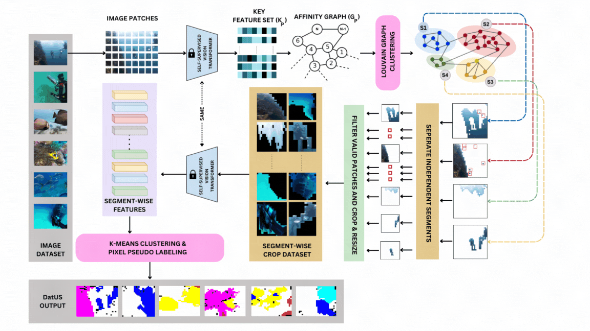

# DatUS: Data-driven Unsupervised Semantic Segmentation with Pre-trained Self-supervised Vision Transformer
#### This [Paper](https://ieeexplore.ieee.org/document/10488760) is accepted in 'IEEE Transactions on Cognitive and Developmental Systems (TCDS)'.
#### [](https://paperswithcode.com/sota/unsupervised-semantic-segmentation-on-suim?p=datus-2-data-driven-unsupervised-semantic)

## DatUS Workflow
<div align="center">
  
</div>

## Data directory organization
```
data
|
dataset_name
|
|── train
|   ├── images
|   |   |── name_1.jpg
|   |   └── name_2.jpg
|   └── true_masks
|       |── name_1.png
|       └── name_2.png
└── val
    ├── images
    |   |── name_1.jpg
    |   └── name_2.jpg
    └── true_masks
        |── name_1.png
        └── name_2.png
```

## Steps for Pseudo Mask Generation and Evaluation
```    
    1. Setup and activate the environment:
        1. Run CMD: conda env create -f myenv.yml
        2. Run CMD: conda activate EnvName
           
    2. Data preprocessing:
        1. Download the Suim dataset (URL:) and place the train  & val split in one folder. Inside the train/val folder, keep images in the “images” and masks in the “mask” folder.
        2. Run CMD: cd utils
        3. Run CMD:  python true_annotations.py –data_dir ‘path/to/dataset-directory’ –split ‘train’ –mask_category ‘coarse’
            ▪ python true_annotations.py --data_dir '/home/multimedia/VisionLab/DUSS/data' --split ‘train’ --–mask_category ‘coarse’

    3. Segment discovery and saving segment crops:
        1. Run CMD: cd ..
        2. Run CMD: python segment_discovery.py --head 0 --head_plus 0 --device cpu --split "train" --vit_size vitb --patch_size 8 --data_dir “path/to/dataset-directory” 
            ▪ python segment_discovery.py --head 0 --head_plus 0 --device cpu --split "train" --vit_size vitb --patch_size 8 --data_dir "./data"
            ▪ Two CSV files and their corresponding CROP datasets will be saved in the outputs folder.
            ▪ The  CSV/CROP file name with and without contains information on raw and processed segmentations, respectively.
              
    4. Segment-wise feature (CLS) extraction from DINOs’ vision transformer:
        1. Download the pre-trained weight of DINO_ViTb or the required model from the dino's GitHub repo.
        2. Run CMD:  python CLS_extractor.py --crop_path ".path/to/crop_directory" --pretrained_weight 'path/to/dinovit_models’/pretrained_weight' --batch_size_per_gpu 8 --arch vit_base patch_size 8 --split train --viz_validSegs “True_for_storing_valid_segment_seperately”
            ▪ python CLS_extractor.py --crop_path "./outputs/crop_dir" --pretrained_weight 'checkpoints/b8_checkpoint.pth' --batch_size_per_gpu 8 --arch vit_base --patch_size 8 --split train --viz_validSegs True
        ◦ NOTE:  Alternatively, for segment-wise feature extraction from MoCos’ CNN backbone:
            ▪ Run CMD: python feat_extractore.py --model 'resnet50_mocov2' --device cpu –crop_path “path/to/crop/dir” --viz_validSegs “True_for_storing_valid_segment_seperately”
                • python feat_extractor.py --model 'resnet50_mocov2' --device cuda:0 --crop_path ./outputs/crop_dir --viz_validSegs True
                  
    5. Segment-wise pseudo labeling:
        1. Run CMD: python seg_pseudoLabeling.py --csv True --n_clusters 6 --save_clusters True
            ▪ set “--csv” attribute True for generating pseudo labels of vision transformers’ feature set (CLS), for CNN-based set False.
            ▪ The CSV file (train_PlabelLUV_Plus.csv) containing pseudo labeling information of valid segments will be saved in output directly. Also, centroids information will be saved as npy file.
            ▪ If “--save_clusters” is True, the cluster will be saved in the outputs directory.


    6. Generate initial pseudo-annotated  segmentation masks:
        1. Run CMD: python generate_PseudoMapV2.py --split train --n_clusters 6 --patch_size 8 --device cuda:0
            ▪ The pseudo masks will be saved into the outputs directory in a separate folder. 
              
    7. Evaluate the initial pseudo-annotated segmentation masks:
        1. Run CMD: python evalV2.py --split train --n_clusters 6 --t_clusters 6 --data_dir './data' --device CPU
            1. ‘--n_clusters’ and ‘—t_clusters’ indicated the number of pseudo and true clusters, respectively.
               
    8. Visualize colored pseudo masks:
        1. Run CMD: cd utils
        2. Run CMD: python color_Mask.py --n_clusters 6 --t_clusters 6 --split train --mask_path ‘path/to/grayMask’ --map_path ‘path/to/map.csv’
```

## Citation
```
@ARTICLE{10488760,
  author={Kumar, Sonal and Sur, Arijit and Baruah, Rashmi Dutta},
  journal={IEEE Transactions on Cognitive and Developmental Systems}, 
  title={DatUS: Data-driven Unsupervised Semantic Segmentation with Pre-trained Self-supervised Vision Transformer}, 
  year={2024},
  volume={},
  number={},
  pages={1-14},
  keywords={Training;Task analysis;Transformers;Semantic segmentation;Feature extraction;Visualization;Semantics;Self-supervised learning;vision transformer;unsupervised learning;semantic segmentation;representation learning;computer vision;deep learning},
  doi={10.1109/TCDS.2024.3383952}}
```

